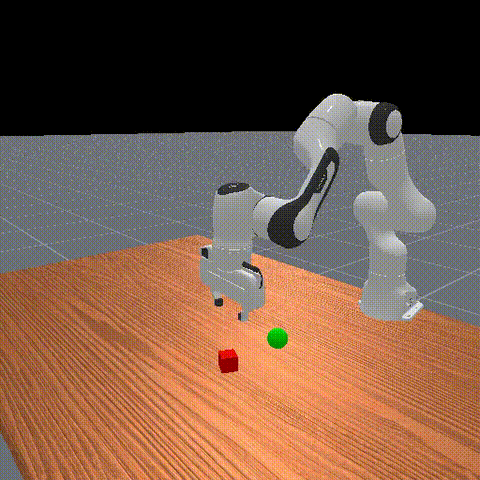

# Diffusion Policy for ManiSkill Pick-and-Place

A diffusion policy that learns to generate robot action trajectories for pick-and-place tasks using the [ManiSkill](https://maniskill.readthedocs.io/) benchmark. The policy takes robot proprioception as input and outputs a chunk of future joint-position actions via iterative DDIM denoising.

Trained and evaluated on an **NVIDIA RTX 4070 (12 GB VRAM)**.

## Demo



## Results

Trained on 1000 expert (motion-planning) demonstrations for PickCube-v1.

| Epoch | Success Rate | Avg Episode Length |
|-------|-------------|-------------------|
| 100   | 79%         | 108.0             |
| 200   | 74%         | 109.8             |
| 300   | 73%         | 110.6             |

## Architecture

- **Noise prediction network**: 1D Temporal U-Net (128 → 256 → 512 channels) with FiLM conditioning on diffusion timestep
- **Observation encoder**: 2-layer MLP encoding flattened observation history
- **Diffusion schedule**: Squared cosine (improved DDPM), 100 training steps, 10 DDIM inference steps
- **Action chunking**: Predict 16 steps, execute 8 (receding horizon)

## Project Structure

```
diffpolicy/
├── config/train.yaml          # Hydra config
├── data/
│   ├── dataset.py             # HDF5 dataset with obs/action chunking
│   └── normalize.py           # Per-dim min/max normalization
├── model/
│   ├── unet1d.py              # 1D Temporal U-Net backbone
│   ├── diffusion.py           # DDPM training + DDIM inference
│   └── obs_encoder.py         # State MLP encoder
├── train.py                   # Training entry point
├── evaluate.py                # Rollout + metrics + video recording
└── requirements.txt
```

## Setup

```bash
python -m venv .venv
source .venv/bin/activate
pip install -r requirements.txt
```

## Data Collection

Download and replay ManiSkill expert demonstrations with state observations:

```bash
python -m mani_skill.utils.download_demo PickCube-v1

python -m mani_skill.trajectory.replay_trajectory \
  --traj-path ~/.maniskill/demos/PickCube-v1/motionplanning/trajectory.h5 \
  --save-traj \
  --obs-mode state \
  --num-envs 10
```

## Training

```bash
python train.py
```

Key training settings (see `config/train.yaml`):
- Batch size: 64 (effective 256 with grad accumulation x4)
- Learning rate: 1e-4 with cosine decay
- Mixed precision (fp16)
- EMA decay: 0.995
- 300 epochs (~4-6 hours on RTX 4070)

## Evaluation

```bash
python evaluate.py \
  --checkpoint checkpoint_epoch100.pt \
  --config config/train.yaml \
  --normalizer normalizer.json \
  --num-episodes 100
```

Add `--save-video --video-dir eval_videos` to record episode videos.

## Key References

- Chi et al., "Diffusion Policy: Visuomotor Policy Learning via Action Diffusion" (RSS 2023)
- [ManiSkill documentation](https://maniskill.readthedocs.io/)
