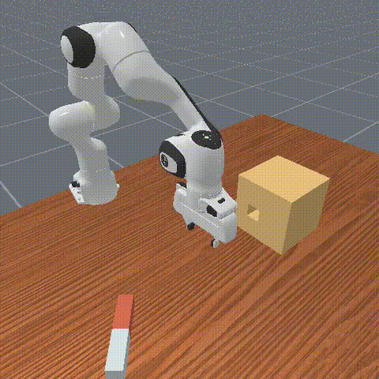

# Diffusion Policy for ManiSkill Manipulation

A diffusion policy that learns to generate robot action trajectories for manipulation tasks using the [ManiSkill](https://maniskill.readthedocs.io/) benchmark. The policy takes robot proprioception as input and outputs a chunk of future joint-position actions via iterative DDIM denoising.

Trained and evaluated on an **NVIDIA RTX 4070 (12 GB VRAM)**.

## Tasks

### PickCube-v1

Pick up a cube and hold it at a goal position. A simpler task used to validate the pipeline.


| Epoch | Success Rate | Avg Episode Length |
|-------|-------------|-------------------|
| 100   | 79%         | 108.0             |
| 200   | 74%         | 109.8             |
| 300   | 73%         | 110.6             |

- **1000 demos**, 300 epochs, ~40 min training

### PegInsertionSide-v1

Pick up a peg lying flat on a table and insert it into a tight-clearance hole on a box. Requires precise 6-DOF alignment across multiple phases: approach, grasp, reorient, align, and insert. Peg geometry (length, radius) is randomized per episode.



| Epoch | Success Rate | Avg Episode Length |
|-------|-------------|-------------------|
| 500   | 63%         | 272.5             |

- **996 demos**, 500 epochs, ~2 hrs training
- ~3mm clearance between peg and hole
- Randomized peg dimensions and poses each episode

## Architecture

- **Noise prediction network**: 1D Temporal U-Net (128 → 256 → 512 channels) with FiLM conditioning on diffusion timestep
- **Observation encoder**: MLP encoding flattened observation history (2-layer for PickCube, 3-layer for PegInsertion)
- **Diffusion schedule**: Squared cosine (improved DDPM), 100 training steps, 10 DDIM inference steps
- **Action chunking**: Predict 16 steps, execute 8 (receding horizon)

## Project Structure

```
diffpolicy/
├── config/
│   ├── train.yaml                # PickCube config
│   └── train_peginsertion.yaml   # PegInsertionSide config
├── data/
│   ├── dataset.py                # HDF5 dataset with obs/action chunking
│   └── normalize.py              # Per-dim min/max normalization
├── model/
│   ├── unet1d.py                 # 1D Temporal U-Net backbone
│   ├── diffusion.py              # DDPM training + DDIM inference
│   └── obs_encoder.py            # State MLP encoder
├── train.py                      # Training entry point
├── evaluate.py                   # Rollout + metrics + video recording
└── requirements.txt
```

## Setup

```bash
python -m venv .venv
source .venv/bin/activate
pip install -r requirements.txt
```

## Data Collection

Download and replay ManiSkill expert demonstrations with state observations:

```bash
# PickCube
python -m mani_skill.utils.download_demo PickCube-v1
python -m mani_skill.trajectory.replay_trajectory \
  --traj-path ~/.maniskill/demos/PickCube-v1/motionplanning/trajectory.h5 \
  --save-traj --obs-mode state --num-envs 10

# PegInsertionSide
python -m mani_skill.utils.download_demo PegInsertionSide-v1
python -m mani_skill.trajectory.replay_trajectory \
  --traj-path ~/.maniskill/demos/PegInsertionSide-v1/motionplanning/trajectory.h5 \
  --save-traj --obs-mode state --num-envs 10
```

## Training

```bash
# PickCube (300 epochs, ~40 min on RTX 4070)
python train.py

# PegInsertionSide (500 epochs, ~2 hrs on RTX 4070)
python train.py --config-name train_peginsertion
```

Key training settings:
- Batch size: 64 (effective 256 with grad accumulation x4)
- Learning rate: 1e-4 with cosine decay
- Mixed precision (fp16)
- EMA decay: 0.995

## Evaluation

```bash
python evaluate.py \
  --checkpoint checkpoint_epoch500.pt \
  --config config/train_peginsertion.yaml \
  --normalizer normalizer.json \
  --env-id PegInsertionSide-v1 \
  --num-episodes 100 \
  --save-video --video-dir eval_videos
```

## Key References

- Chi et al., "Diffusion Policy: Visuomotor Policy Learning via Action Diffusion" (RSS 2023)
- [ManiSkill documentation](https://maniskill.readthedocs.io/)
